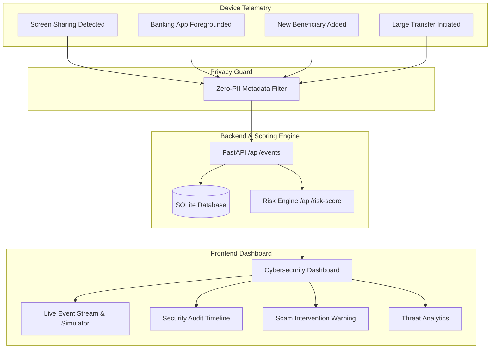

# GuardianAI 🛡️

> **Privacy-First Device-Side Behavioural Monitoring System for Detecting Coached Financial Scams Involving Remote Screen Sharing**
> *Developed for MUSA CodeX PS1 Hackathon*

---

## 1. Project Overview

**GuardianAI** is a cybersecurity sentinel engineered to intercept remote-coached financial fraud. Fraudsters frequently manipulate victims (especially elderly citizens) via phone calls to install screen-sharing software (such as AnyDesk or TeamViewer), open banking applications, add fraudulent beneficiaries, and transfer funds under deception.

GuardianAI detects these suspicious behavioral sequences directly on the device and halts transactions **before money leaves the victim's account**.

---

## 2. Problem Statement & Threat Scenario

### Coached Remote Screen-Sharing Scam Vector:
1. **Initial Contact**: Attacker calls victim posing as customer care, tech support, courier refund desk, or bank fraud investigator.
2. **Screen-Share Download**: Attacker guides the victim to install remote assistance software (AnyDesk, TeamViewer, QuickSupport).
3. **Banking App Access**: Attacker asks the victim to open their banking or UPI application while viewing/coaching the screen.
4. **Rapid Beneficiary Addition**: Victim creates an unfamiliar payee account under verbal instructions.
5. **High-Value Transfer**: Victim is instructed to initiate an immediate transfer (e.g., ₹1,85,000) under false pretenses.

---

## 3. The GuardianAI Solution

GuardianAI provides an on-device protective barrier that:
- **Correlates Multi-Signal Telemetry**: Analyzes combinations of screen mirroring, active financial apps, payee additions, and transfer amounts.
- **Privacy-First Architecture**: Inspects only behavioral metadata—**zero keystrokes, zero screenshots, zero OTPs/passwords**.
- **Calculates Real-Time Risk Index**: Dynamically transitions device status between `SAFE`, `MONITORING`, and `THREAT DETECTED`.
- **Elderly-Friendly Intervention**: Displays high-contrast, plain-language emergency warnings with 1-tap "Cancel Transaction".

---

## 4. System Architecture



---

## 5. Tech Stack

- **Frontend**: React 18, Vite, Tailwind CSS, Lucide React icons, Recharts, Axios
- **Backend**: Python 3.12, FastAPI, Pydantic v2, SQLAlchemy, Uvicorn, SQLite
- **Documentation & ML Specifications**: Markdown, JSON Schema, Mermaid

---

## 6. Folder Structure

```
guardian-ai/
├── frontend/                     # React + Vite cybersecurity dashboard
│   ├── src/
│   │   ├── components/
│   │   │   ├── common/           # Navbar, RiskGauge, Status Cards
│   │   │   ├── dashboard/        # Home Dashboard & Device Telemetry
│   │   │   ├── live/             # Real-time Stream & Interactive Simulator
│   │   │   ├── intervention/     # Elderly-Friendly Scam Warning Modal
│   │   │   ├── timeline/         # Chronological Session Timeline
│   │   │   └── analytics/        # Recharts Data Visualizations
│   │   ├── context/              # SecurityContext (State, Simulation Handlers)
│   │   ├── services/             # API client layer (api.js)
│   │   ├── index.css             # Glassmorphic cyber theme styling
│   │   └── App.jsx               # Main App layout
│   ├── package.json
│   ├── tailwind.config.js
│   └── vite.config.js
├── backend/                      # FastAPI backend engine
│   ├── app/
│   │   ├── api/                  # Modular endpoint routers
│   │   │   ├── endpoints/        # health, events, risk, session, intervention, analytics, simulator
│   │   │   └── router.py
│   │   ├── core/                 # App configuration & settings
│   │   ├── db/                   # SQLite models & database session
│   │   ├── schemas/              # Pydantic schemas with privacy validation
│   │   ├── services/             # risk_engine.py (isolated scoring) & simulator_service.py
│   │   └── main.py               # FastAPI app definition & CORS
│   ├── requirements.txt
│   └── run.py                    # Python launch script
├── ml/                           # Phase 2 ML feature specifications & pipeline roadmap
├── data/                         # Synthetic data generator specs & privacy schema
├── docs/                         # Architecture specification & Threat model
└── README.md
```

---

## 7. How to Run

### Prerequisites
- Python 3.10+
- Node.js 18+ and npm

### 1. Start Backend
```bash
# From repository root:
pip install -r backend/requirements.txt
python backend/run.py
```
Backend will start on: **`http://localhost:8000`**
Interactive Swagger API docs: **`http://localhost:8000/docs`**

### 2. Start Frontend
```bash
# In a new terminal:
cd frontend
npm install
npm run dev
```
Frontend will start on: **`http://localhost:5173`**

---

## 8. API Endpoints

| Method | Endpoint | Description |
| :--- | :--- | :--- |
| `GET` | `/api/health` | Service health status & telemetry mode check |
| `POST` | `/api/events` | Ingests a new device-side behavioural event |
| `GET` | `/api/events` | Lists chronological events (filterable by `session_id`) |
| `POST` | `/api/risk-score` | Computes scam risk score and flags triggers |
| `GET` | `/api/session/{session_id}` | Retrieves full session, events, and interventions |
| `GET` | `/api/sessions` | Lists recent monitoring sessions |
| `POST` | `/api/intervention` | Records user resolution (`CANCEL_TRANSACTION` / `TRUST_USER`) |
| `GET` | `/api/analytics` | Aggregated threat stats, pattern breakdown, and charts data |
| `POST` | `/api/simulator/step` | Advances simulated coached scam sequence |
| `POST` | `/api/simulator/reset` | Resets session back to clean SAFE state |
| `GET` | `/api/simulator/state` | Returns current simulator stage and scenario catalog |

---

## 9. Interactive Coached Scam Simulator

The built-in event simulator replicates the 6-stage coached fraud sequence:
1. **Screen Sharing Started**: AnyDesk / TeamViewer remote access detected.
2. **Banking App Foregrounded**: HDFC / SBI mobile banking opened during active screen share.
3. **New Beneficiary Added**: Rapid clipboard paste of unfamiliar recipient.
4. **Large Transaction Initiated**: ₹1,85,000 transfer created.
5. **Suspicious Behaviour Flagged**: Multi-factor behavioural risk score spikes to **94% (THREAT DETECTED)**.
6. **Intervention Triggered**: Elderly-friendly Scam Warning Modal prompts user to cancel transfer.

---

## 10. Privacy-First Architectural Guarantee

GuardianAI strictly enforces:
- **No Password / PIN / MPIN Collection**
- **No OTP Interception**
- **No Keystroke Logging**
- **No Screen Capture / Recording**
- **No Real Banking Credentials or Financial Account Balances**

All evaluation is performed over abstracted behavioural event metadata.

---

## 11. Current Limitations (Phase 1)
- **Heuristic Scoring**: Uses rule-based behavioral weights rather than trained ML model inference.
- **Local SQLite DB**: Uses lightweight local database for prototype sessions.
- **Simulated Device Hooks**: Device hooks are simulated via the simulator pipeline rather than native Android accessibility services.

---

## 12. Phase 2 Plan: Synthetic Dataset & Behavioral ML Model
1. **Synthetic Behavioral Data Generator**: Generate 50,000+ synthetic session traces covering legitimate transfers vs. coached fraud patterns.
2. **Lightweight ML Classifier**: Train an on-device ONNX / XGBoost model capable of detecting novel social-engineering patterns with sub-millisecond latency.
3. **Android Accessibility / Knox Telemetry Service**: Bind to real OS screen-casting callbacks and financial app foreground events.
4. **Voice Emotion / Coaching Cadence Analyzer**: Optional local audio cadence detection to identify ongoing phone calls during banking sessions.
