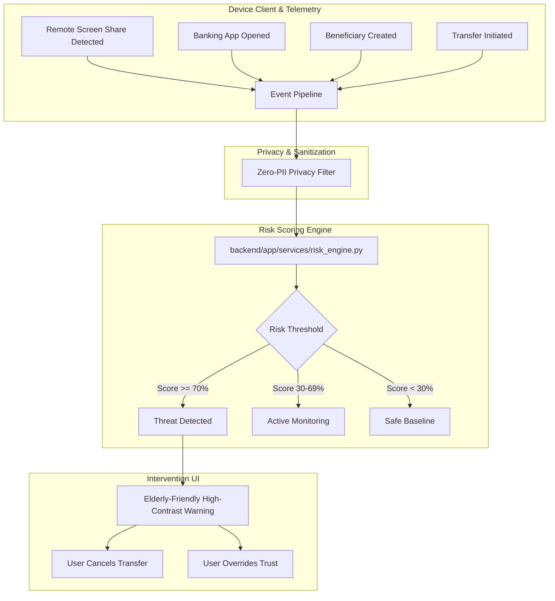

# GuardianAI - Architecture Specification

## 1. High-Level Architecture

GuardianAI operates as an on-device behavioural sentinel designed to identify social engineering and remote screen sharing scams in real-time.

## 2. Privacy-First Principles
- **No Keystroke Logging**: Only abstract speed metrics (e.g. typing cadence variance, paste detection).
- **No Screen Capture**: Screen contents, balances, and recipient account numbers are never photographed or transmitted.
- **No Credential Interception**: Passwords, MPINs, and OTPs remain strictly inaccessible.
- **Local / Edge Processing**: Behavioural evaluation operates locally without transmitting financial state to external cloud entities.
