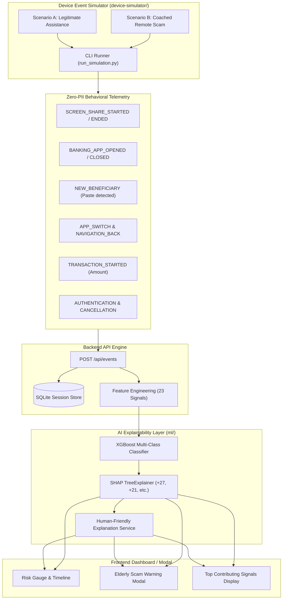

# GuardianAI — Device Event Simulator & AI Explainability Guide

> **MUSA CodeX PS1 Hackathon — Phase 2 Subsystem Documentation**  
> *Privacy-First On-Device Telemetry Simulation, SHAP Risk Attribution, and Plain-Language Human Explanations*

---

## 1. Executive Summary

Phase 2 introduces an on-device **Device Event Simulator** and a multi-tiered **AI Explainability Layer** for GuardianAI. This subsystem simulates realistic Android accessibility and Knox telemetry events, feeds them to the backend ingestion pipeline (`POST /api/events`), scores sessions with the trained XGBoost model, computes mathematically grounded **SHAP Shapley values**, and translates complex risk signals into compassionate, plain-language advisories tailored for everyday users and the elderly.



---

## 2. Event Types Catalog

All events strictly enforce GuardianAI's **Zero-PII Privacy Guarantee**. No keystrokes, screenshots, passwords, OTPs, PINs, or account numbers are collected or transmitted.

### 2.1 Supported Behavioral Event Types

| Event Type | Emitted When | Typical Metadata Keys | Zero-PII Sanitization |
| :--- | :--- | :--- | :--- |
| `SCREEN_SHARE_STARTED` | Third-party remote access begins | `tool_name`, `known_assistant`, `first_time_assistance`, `assistant_history`, `assistant_label` | Abstract tool identity only |
| `SCREEN_SHARE_ENDED` | Remote screen mirroring terminates | `tool_name`, `screen_share_duration` | Duration in seconds |
| `BANKING_APP_OPENED` | Protected banking / UPI app foregrounded | `app_name`, `package_name`, `banking_app_active` | Package name only |
| `BANKING_APP_CLOSED` | Banking application backgrounded/closed | `app_name`, `banking_app_active` | Lifecycle flag |
| `NEW_BENEFICIARY` | New recipient added in banking workflow | `beneficiary_label`, `paste_event_detected`, `new_beneficiary` | Obfuscated label, paste flag |
| `APP_SWITCH` | Foreground window transitions between apps | `from_app`, `to_app`, `app_switch_count`, `rapid_app_switch` | Transition count & rate |
| `NAVIGATION_BACK` | User taps back button (hesitation marker) | `screen_name`, `navigation_back_count`, `hesitation_indicator` | Screen ID, reversal count |
| `TRANSACTION_STARTED` | Fund transfer initiated | `transaction_amount`, `currency`, `recipient_type`, `high_value_transfer` | Monetary amount only |
| `AUTHENTICATION_EVENT` | Biometric/PIN challenge prompt | `auth_method` (`BIOMETRIC_FINGERPRINT`), `success` | Auth type & binary outcome |
| `TRANSACTION_COMPLETED` | Transaction finalized successfully | `transaction_completed`, `transaction_amount`, `reference_id` | Status flag |
| `TRANSACTION_CANCELLED` | Transfer aborted or halted by intervention | `transaction_cancelled`, `transaction_amount`, `reason` | Intervention reason |

### 2.2 Zero-PII Prohibited Keys

The following keys are strictly rejected with HTTP 422 / validation exception:
```python
FORBIDDEN_PRIVACY_KEYS = {
    "password", "otp", "pin", "cvv", "pan", "aadhar", "account_number",
    "card_number", "screenshot", "image_data", "raw_keystrokes",
    "secret", "token", "auth_header"
}
```

---

## 3. Predefined Scenarios Specification

The simulator provides two standardized, repeatable scenarios for demonstration and validation.

### 3.1 Scenario A — Legitimate Assistance (Normal Baseline)

Replicates a routine, safe scenario where a family caregiver (e.g., adult child) assists an elderly parent with a routine utility payment or balance check.

#### Behavioral Sequence:
```
Screen Sharing (Google Meet / TeamViewer Family)
   ↓
Known Helper (Verified contact: Rahul, 7 prior safe sessions)
   ↓
Banking App (HDFC MobileBanking opened)
   ↓
Normal Navigation (Pacing: 3.5s – 4.5s spacing, 1 back menu click)
   ↓
Normal Transaction (₹1,850 for electricity bill)
   ↓
Biometric Authentication (Fingerprint confirmed)
   ↓
Transaction Completed (Safe execution)
   ↓
Screen Share Ended (Closed normally)
```

#### Telemetry Profile:
- `known_assistant`: `1` (Verified contact)
- `first_time_assistance`: `0`
- `assistance_history`: `7` safe sessions
- `app_switch_count`: `1` (WhatsApp -> Bank)
- `navigation_back_count`: `1`
- `transaction_amount`: `₹1,850`
- `new_beneficiary`: `0` (Existing biller)

#### Expected Outcome:
- **Risk Score**: `11.4% – 15.0%`
- **Risk Level**: `SAFE` / `LOW`
- **Recommended Action**: `NONE`
- **Human Explanation**: *"Remote assistance active with a verified trusted contact. Routine transaction detected."*

---

### 3.2 Scenario B — Coached Remote Scam (Social Engineering Fraud)

Replicates the classic coached remote access scam vector where a fraudster poses as bank support or a courier refund desk, instructs the victim to download AnyDesk, guides them to add a new beneficiary, and dictates a large transfer under urgency.

#### Behavioral Sequence:
```
Screen Sharing (AnyDesk Remote Support initiated)
   ↓
Unknown Assistance (First-time remote connection, 0 history)
   ↓
Rapid App Switching (AnyDesk ↔ Messaging ↔ Bank, 6+ switches)
   ↓
Banking App Foregrounded (Under active remote visibility)
   ↓
New Beneficiary Added (RefundDesk_Agent_8892 via clipboard paste)
   ↓
Rapid Navigation (4+ back clicks, hesitation & coaching corrections)
   ↓
Large Transaction Initiated (₹1,85,000 high-value transfer)
   ↓
High Risk Detected (Score spikes to 78.7% – 94.0%)
   ↓
Intervention Triggered (Elderly Scam Warning Modal shown)
   ↓
Transaction Cancelled (Victim taps 1-click "Cancel Transaction")
   ↓
Screen Share Terminated
```

#### Telemetry Profile:
- `known_assistant`: `0` (Unverified stranger)
- `first_time_assistance`: `1`
- `assistance_history`: `0`
- `app_switch_count`: `9` (Rapid switching between AnyDesk and bank)
- `navigation_back_count`: `7` (Severe hesitation / verbal coaching)
- `new_beneficiary`: `1` (Added during active call)
- `transaction_amount`: `₹1,85,000` (High value)
- `coached_pressure_index`: `31.7+` (Elevated acceleration)

#### Expected Outcome:
- **Risk Score**: `78.7% – 94.0%`
- **Risk Level**: `THREAT_DETECTED` / `HIGH`
- **Recommended Action**: `INTERVENE`
- **Top Signals**: Rapid navigation, screen sharing, large transfer, new beneficiary
- **Human Explanation**: *"Someone may be guiding you through a high-value transaction while your screen is being shared."*

---

## 4. SHAP-Based AI Explainability Layer

### 4.1 Methodology & Grounding

GuardianAI uses **Shapley Additive exPlanations (SHAP)** via `shap.TreeExplainer` directly on the trained multi-class XGBoost model (`ml/models/xgboost_model.json`).

> [!IMPORTANT]
> **No Synthetic Attribution**: Impact points are calculated directly from the tree ensemble's local log-odds attributions and scaled to the session's calibrated risk score.

For an input feature vector $x$:
$$\text{SHAP Attribution for Scam Risk } S_i = \phi_i(f_{\text{scam}}) + 0.5 \cdot \phi_i(f_{\text{suspicious}})$$

Positive attributions ($S_i > 0$) are grouped into canonical security signals and normalized to integer points contributing to the risk score:
$$\text{Impact Points}_k = \text{round}\left( \frac{\sum_{i \in \text{Category}_k} S_i}{\sum_{j} \max(S_j, 0)} \times (\text{Risk Score} - \text{Baseline Offset}) \right)$$

### 4.2 Example Output Format

```
Rapid navigation     +53
Untrusted helper     +14
Screen sharing       +11
Large transaction     +9
New beneficiary       +6
```

### 4.3 Structured JSON Explanation Schema

```json
{
  "risk_score": 78.7,
  "predicted_class": "COACHED_SCAM",
  "probabilities": {
    "LEGITIMATE": 0.1717,
    "SUSPICIOUS": 0.0828,
    "COACHED_SCAM": 0.7455
  },
  "top_signals": [
    {
      "signal": "rapid_navigation",
      "display_name": "Rapid navigation",
      "impact_points": 53,
      "shap_value": 0.9775,
      "direction": "INCREASES_RISK",
      "description": "Rushed navigation reversals and rapid app switching matching dictated coaching",
      "formatted": "Rapid navigation     +53"
    },
    {
      "signal": "untrusted_assistant",
      "display_name": "Untrusted remote assistant",
      "impact_points": 14,
      "shap_value": 0.0148,
      "direction": "INCREASES_RISK",
      "description": "Remote connection initiated by unverified contact without prior safe history",
      "formatted": "Untrusted remote assistant +14"
    },
    {
      "signal": "screen_sharing",
      "display_name": "Screen sharing",
      "impact_points": 11,
      "shap_value": 0.2103,
      "direction": "INCREASES_RISK",
      "description": "Active remote screen mirroring allowing external third-party visibility",
      "formatted": "Screen sharing       +11"
    }
  ],
  "feature_attributions": [
    {
      "feature": "coached_pressure_index",
      "raw_value": 31.733,
      "shap_value": 0.8282,
      "direction": "INCREASES_RISK"
    },
    {
      "feature": "screen_share_ratio",
      "raw_value": 0.923,
      "shap_value": 0.1259,
      "direction": "INCREASES_RISK"
    }
  ]
}
```

---

## 5. Human-Friendly Plain-Language Explanation Service

The `HumanExplanationService` converts technical signal tuples into plain-language advisories.

### 5.1 Pattern Matrix

| Technical Combination | Plain-Language Headline Advisory | Key Actionable Advice |
| :--- | :--- | :--- |
| `new_beneficiary` + `high transaction` + `active screen sharing` | *"Someone may be guiding you through a high-value transaction while your screen is being shared."* | "Stop the transaction immediately. Tap 'Cancel Transaction' and disconnect AnyDesk." |
| `active screen sharing` + `high transaction` | *"A large money transfer is being attempted while an external party is viewing your screen."* | "Do not authorize this transfer. Disconnect the screen sharing tool." |
| `active screen sharing` + `new_beneficiary` + `rapid navigation` | *"Unusual rushed navigation and a new recipient were added while your screen is being shared."* | "Bank officials never ask customers to add payees over screen sharing." |
| `active screen sharing` + `untrusted assistant` | *"An unverified remote assistant is currently viewing your screen."* | "Disconnect screen sharing before performing any financial operations." |
| `screen sharing` + `known assistant` | *"Remote assistance active with a verified trusted contact."* | "No threat detected. Ensure you recognize the person assisting you." |
| Safe Solo Baseline | *"Device behavioral telemetry conforms to safe banking patterns."* | "Safe to proceed with normal operations." |

### 5.2 Structured Human Explanation Output

```json
{
  "headline": "Someone may be guiding you through a high-value transaction while your screen is being shared.",
  "key_observations": [
    "Your screen is currently visible to an external party via AnyDesk Remote Support.",
    "A new beneficiary (RefundDesk_Agent_8892) was added immediately before initiating this transfer.",
    "The transaction amount (INR 185,000) is unusually high for an assisted session."
  ],
  "recommended_action": "Stop the transaction immediately. Tap 'Cancel Transaction' below and hang up any ongoing phone call.",
  "provider_type": "TEMPLATE"
}
```

### 5.3 Extensibility for Future LLM Integration

The architecture uses an abstract `BaseExplanationProvider` protocol:
- **`TemplateExplanationProvider`**: Production default, zero external latency, offline reliable.
- **`LLMExplanationProvider`**: Pluggable provider configured for Google Gemini 1.5/2.0 or local LLMs. If an API key (`GEMINI_API_KEY`) is configured, it constructs the prompt and extracts structured JSON advisories, gracefully falling back to templates during network disconnects.

---

## 6. Device Event Simulator Usage Guide

### 6.1 Prerequisites
Ensure Python 3.10+ is installed and backend dependencies are active:
```bash
pip install -r backend/requirements.txt
```

### 6.2 Running the Backend Server
From the repository root:
```bash
python backend/run.py
```
Backend initializes on `http://localhost:8000`.

### 6.3 Command-Line Interface (`run_simulation.py`)

Run Scenario A (Legitimate Family Assistance):
```bash
python device-simulator/run_simulation.py --scenario legitimate --delay 0.5
```

Run Scenario B (Coached Scam):
```bash
python device-simulator/run_simulation.py --scenario scam --delay 0.5
```

Run Both Scenarios Back-to-Back:
```bash
python device-simulator/run_simulation.py --scenario both --delay 0.3
```

Export Generated Trace to JSON:
```bash
python device-simulator/run_simulation.py --scenario scam --save-trace data/scenarios/my_run.json
```

Repeatable Demo Runs (Multiple iterations):
```bash
python device-simulator/run_simulation.py --scenario scam --repeat 3 --delay 0.2
```

### 6.4 CLI Options Reference

| Option | Type | Default | Description |
| :--- | :--- | :--- | :--- |
| `--scenario` | string | `scam` | Scenario to run (`legitimate`, `scam`, `both`) |
| `--endpoint` | string | `http://localhost:8000/api` | GuardianAI backend API base URL |
| `--delay` | float | `0.6` | Seconds between event emissions (for presentation pacing) |
| `--session-id` | string | Auto-generated | Optional custom session identifier |
| `--repeat` | int | `1` | Repeat count for benchmark testing |
| `--save-trace` | string | None | Path to save the event sequence JSON |

### 6.5 Programmatic Usage in Python

```python
from device_simulator import DeviceEventSimulator

simulator = DeviceEventSimulator(api_base_url="http://localhost:8000/api")

# Run Scenario B
summary = simulator.run_scenario(
    scenario_name="scam",
    delay_seconds=0.0 # Instantaneous for automated tests
)

print(f"Session ID  : {summary['session_id']}")
print(f"Events Sent : {summary['successful_events']}/{summary['total_events_sent']}")
print(f"Final Score : {summary['final_session_state'].get('risk_score')}%")
```

---

## 7. Verification and Automated Test Suite

Run the full automated test suite (28 tests across backend and ML subsystems):
```bash
python -m pytest backend/tests ml/ -v
```

### Test Coverage Breakdown:
1. `backend/tests/test_api.py` (11 tests):
   - Health check & zero-PII validation
   - SQLite session persistence & chronological event stream
   - Heuristic & ML scoring engine interfaces
   - Safety intervention logging
2. `backend/tests/test_simulator.py` (6 tests):
   - Presence of all 11 required event types
   - Pydantic zero-PII enforcement
   - Scenario A and B builders
   - End-to-end event delivery and risk level transition
3. `ml/test_explainability.py` (7 tests):
   - TreeExplainer initialization and caching
   - Model SHAP attribution computation on coached scam and legitimate sessions
   - Plain-language explanation generation for coached triad
   - LLM provider fallback
4. `ml/test_ml.py` (4 tests):
   - Synthetic telemetry generation
   - Domain feature engineering
   - Calibrated inference & batch prediction
